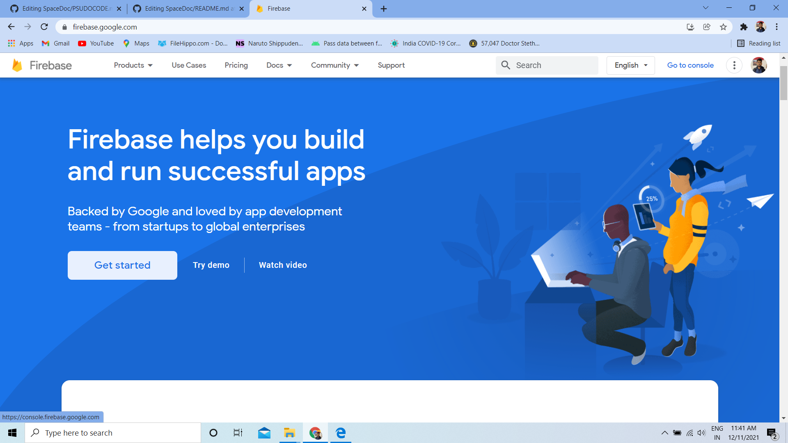
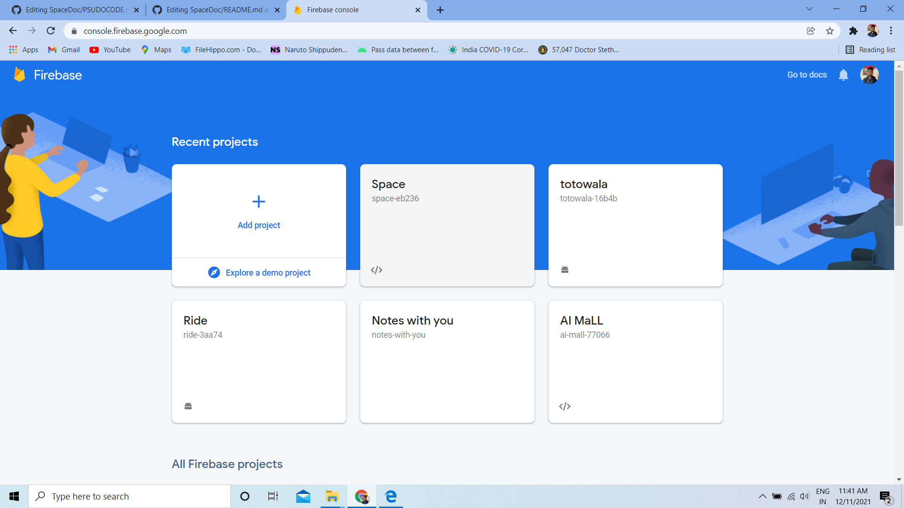
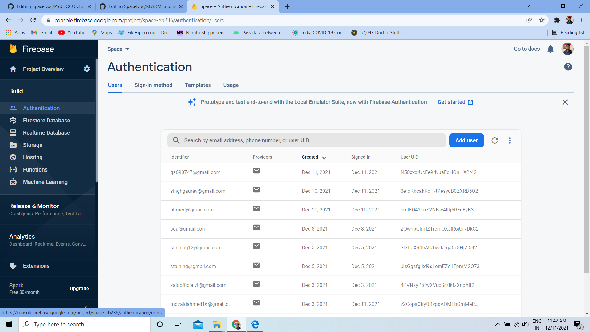
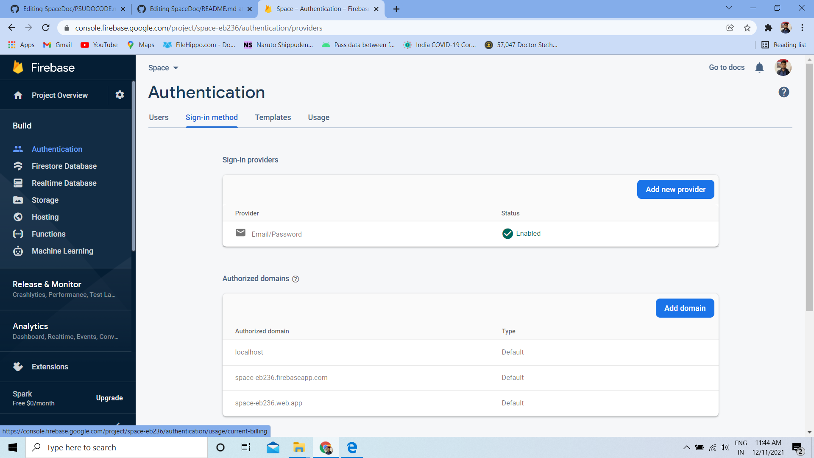
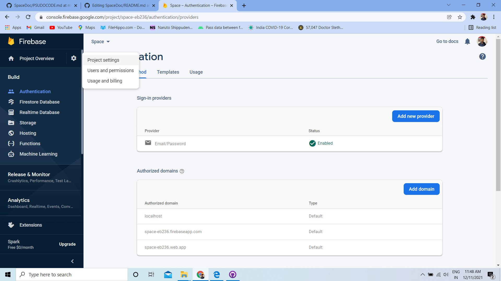
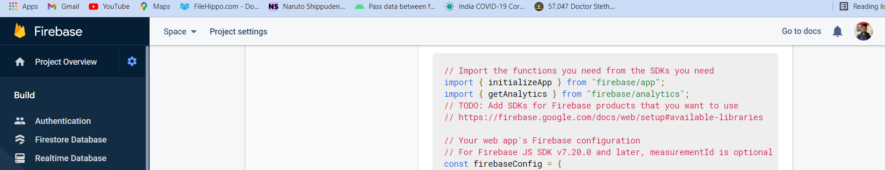

# This is the Psudo code Explaination for SpaceDoc
<strong>A place to share your documents </strong>
 

This is a complete guide to show how i have written the code and its backend 

<strong> Software needed to build the entire site </strong>
<ul><li> Visual Studio Code - software</li>
<li> Live server- Extension for viewing our site while coding </li>
 <li> Balsamiq farmework - To design how our website will look </li>
  <li> Firebase - For all the backend (Firebase is a platform developed by Google for creating mobile and web applications.)</li>
</ul>

  <b>SETTING UP FIREBASE</b>  

 For setting upp the firebase you need to follow the following steps 

<b> #STEP-1 </b>

 Go to firebase webiste .Click on get started  and create a new project.  In my case it already done as Space 

 Go to Authentication method and set sign up method 

 Enable sign -in with email and password 

Now go to project settings and then copy the api and other stuff and paste it in you visual studio script code 

<strong> The Api keys are personal and these data cannot be shared on internet so i have removed that part from the image <strong>
 
 
 Follow same guide line or you can read the entire documentation from firebase for storage purpose as well 

 
 Make sure to link all firebase codes and script attact to your jaavascript to ensure proper running of code   
 You can follow the documentation on firebase for getting started with <a href="https://firebase.google.com/docs/storage/web/start" > Storage</a> and <a href="https://firebase.google.com/docs/database/web/start" >  Real time Database </a>as well
 Since the documentation is already present in firebase   so i'm not explaining it.

 
 <h2> Codes </h2>
 
 There is nothing specific to explain in code section . All files are just basic html and css. Here i will list all the html file name and their purpose . Later in script section i will explain the functionality of these script. <a href=" ">Although i have linked and enitre video explaing my codes </a>
   These are the html files present and their overview 

 <ul><li> index.html - Landing page of website</li>
<li> login.html and signup.html - for authentication and login </li>
 <li> SpaceDoc.html- Main Page which represent the documents gallery </li>
  <li>hrcore.html - Place to upload , share and retrive files among the channel</li>
</ul>

 <h2> Scripts </h2>
 
 Here are the scripts and detail explation on how things work 

 <h3> Login.js <h3>
  <pre>logIn.addEventListener('click',(e)=>
{
  var email = document.getElementById("email").value;
  var password = document.getElementById("password").value;
  signInWithEmailAndPassword(auth, email, password)
  .then((userCredential) => {
    // Signed in 
    const user = userCredential.user;
    const dt = new Date();
    update(ref(database,'users/'+user.uid),{
    last_login:dt

  })
  alert('User Logged in!!');
  location.replace("spacedoc.html"); </pre>
  
  
 In Login.js we have added an event listner to LogIn Button which has been given an id of logIn   
   When an on click is triggger It search for element having id as email and password get its values and check weather there is any user of same email and password  
   if the user is present then in alert box it shows that the <strong> user has been created </strong> and with the help of
    <pre> location.replace("spacedoc.html")  </pre>
  It goes to next page when the user has been succesfully authenticated . Else it will throw any error via these code line 
  
  <pre>.catch((error) => {
    const errorCode = error.code;
    const errorMessage = error.message;
    alert(errorMessage);
  })
 </pre>
  
  

  
  <h3> SignUp <h3>
   <strong> This code is written in signup.html . I haven't made a seprate file for this </strong>
   
 Working is same as of login.js 

   
 For reference we have created variables. As seen earlier  we have added an event listner to SignUp Button which has been given an id of signUp   
   When an on click is triggger It search for element having id as fname,lname,email,password and re-password get its values .

   
   <pre> signUp.addEventListener('click',(e)=>

    {
    var fname = document.getElementById("fname").value;
    var lname = document.getElementById("lname").value;
    var email = document.getElementById("email").value;
    var password = document.getElementById("password").value;
    var repassword = document.getElementById("re-password").value;
    </pre>
   
   
 After getting those value , it check weather the password and re-entered password are the same. Else if they are different , the it will throw an error 

   
   <pre>
    if(password!=repassword){
        alert('Password and re-enter password should be same');
        return;
      }
</pre>

   
 After Checking for password . It will store data in firebase database 

   
  
   <pre>
    createUserWithEmailAndPassword(auth, email, password)
  .then((userCredential) => {
    // Signed in 
    const user = userCredential.user;
    set(ref(database,'users/'+user.uid),{
      username: fname +" " + lname,
      email:email

    });
    </pre>

   
 It will show an alert <strong> user created </strong> and with the help of <strong>  location.replace("login.html") </strong> it will re-direct it to login.html 

   <pre>
    alert('user created');
    location.replace("login.html");
    
  })
   
   </pre>
   
   
 It will catch and show error msg if any is found 

   <pre>
  .catch((error) => {
    const errorCode = error.code;
    const errorMessage = error.message;
    alert(errorMessage);
    // ..
  });</pre>
   
   <h3>Spacedoc.js <h3> 
    
  
 Basically we have design a left menu bar . With opening and closing feature 

    
 Here is the code for opening the nav-bar . We have just called a function openNav() inside which we are changing the value of mySidenav property   
    giving it a width of 230 px and a style margin of 250px 

    
  <pre>
     function openNav() {
   document.getElementById("mySidenav").style.width = "230px";
   document.getElementById("main").style.marginLeft = "250px";
 }
 </pre>
    
  
 Here is the code for closingthe nav-bar . We have just called a function closeNav() inside which we are changing the value of mySidenav property   
    giving it a width of 0 px and a style margin of  0 px  so that it is now not visible

    
  <pre> 
    function closeNav() {
   document.getElementById("mySidenav").style.width = "0";
   document.getElementById("main").style.marginLeft = "0";
 } </pre>
   
