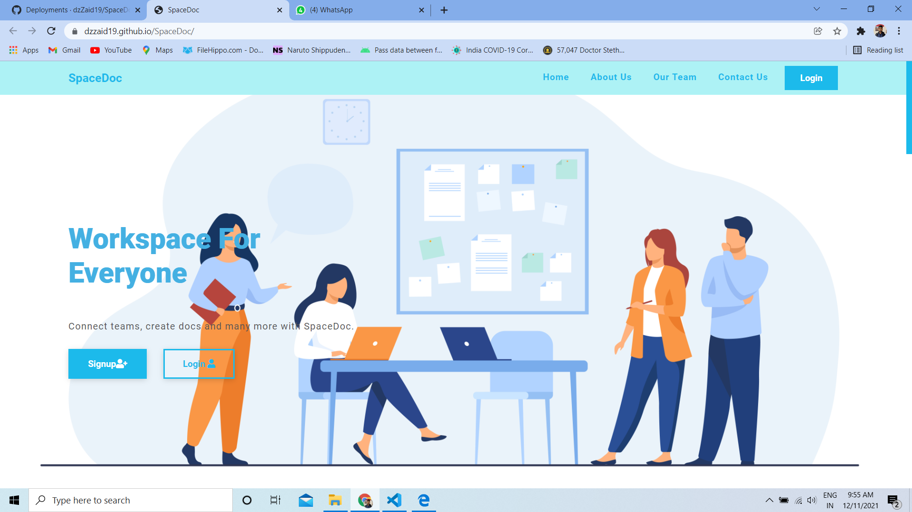
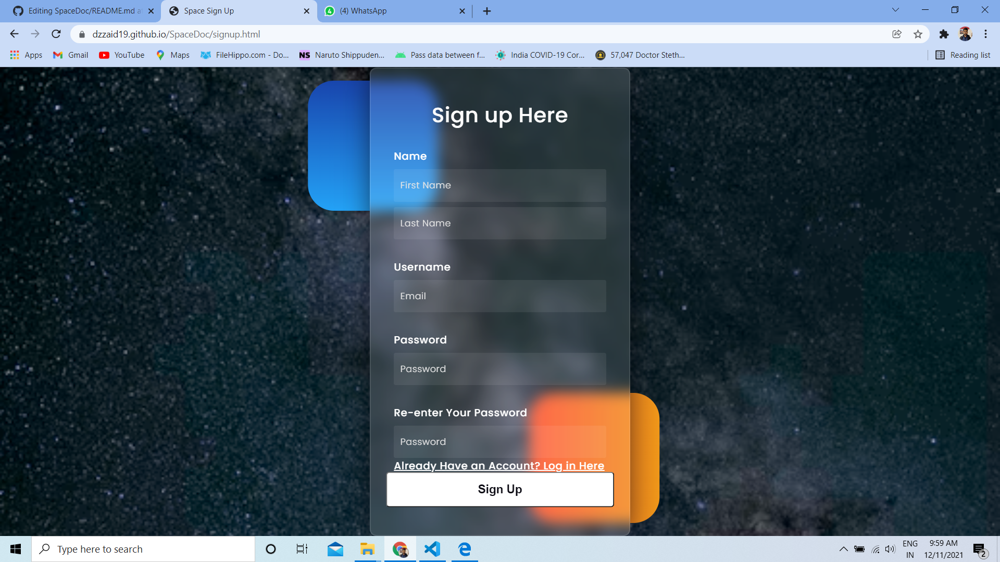
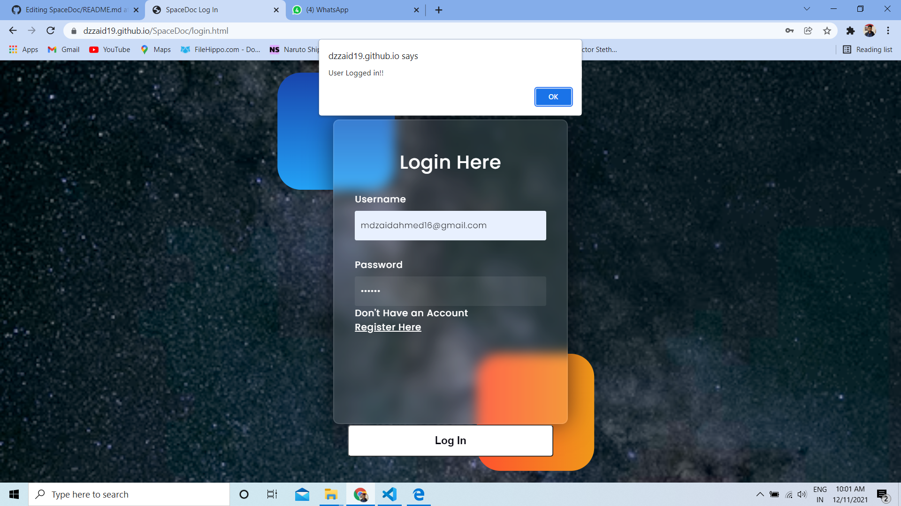
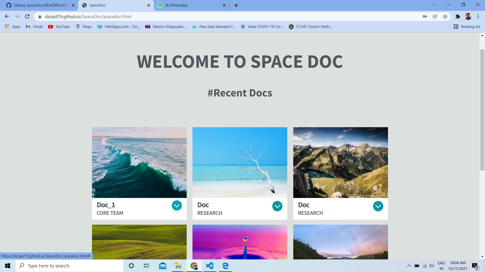
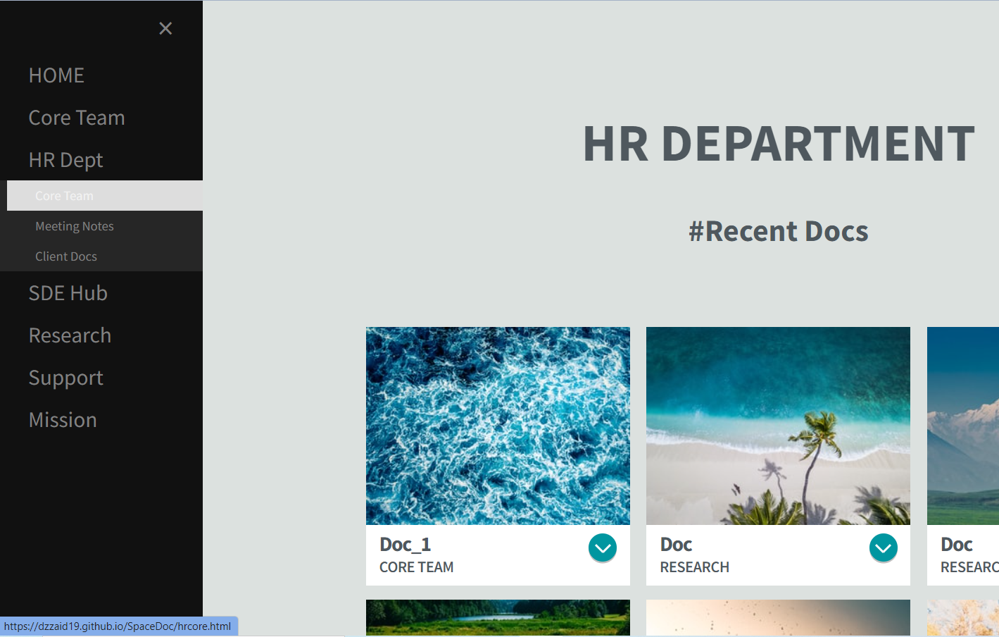
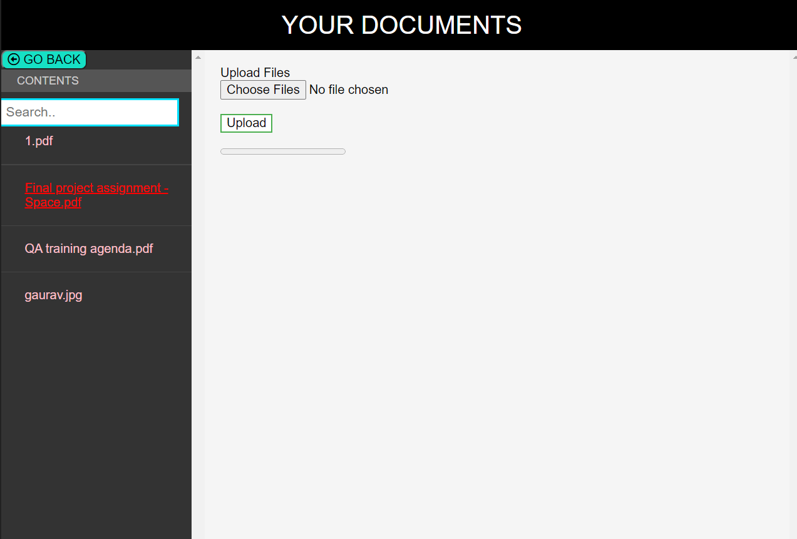

# SpaceDoc
<strong>A place to share your documents </strong>
 

This is a complete guide to show how our website works. <a href="" >Here  I have also added the required code and details like how the specific code works. </a>

<strong> NOTE: If you are a new user i.e. you have already signed up in past, then click on login Button </strong>

  <b>GUIDE FOR OUR WEBSITE SPACE DOC </b>  

 This is how our main page looks .You can ofcourse scroll down and check for learn more , my portfolio and do follow me on my social accounts 

 For getting started if you are a new user than click on Sign-up 

 This is the Sign-up Page for Space Doc  . 

 Fill all the details properly and click on submit 

<strong> NOTE:Password should be atleast 6 character long. Password and re-enter Password must be the same </strong>

When the details are properly filled then on clicking on Sign-up Button , A new User will be created 

 This is the Login for Space Doc  . 

 Fill Your email and password which you have used to in Sign-up page for creating new user 

<strong> After this, you will be succesfully log-in to the main page of SPACE DOC </strong>

 This is the Main Page of Space Doc  . 

 This is a simple representation of gallery where in future your documents can be viewed . Due to shortage of time this section has been left and will be completed in future 

<strong> We have left menu bar which was asked which sould be in  expandable hierarchy </strong>

Now , Here is the main part of the entire project . 

<b >Go , Either in "Core Teams" under the "Hr-Dept" Secttion or in "Your Channel" . <b>

<pre>This is the place to store and retrive your documents </pre> 

<strong> NOTE:WHEN THE FILE IS UPLODADED , PLEASE REFRESH THE SITE TO SEE THE UPLOADED FILE IN LEFT MENU BAR OF THIS PAGE.  
We have also added search bar as told in assement altough due to time limitation i was not able to make it functional</strong>

